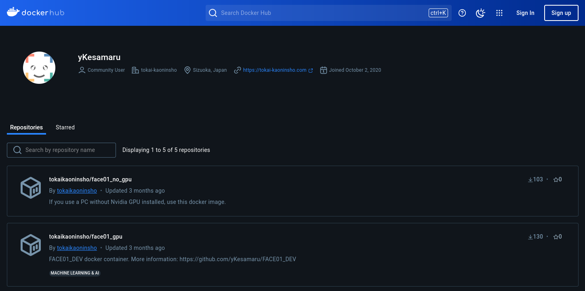
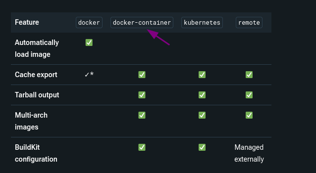

> このドキュメントは
> docker imageをアップルシリコン製マックに対応させようと思い書き始めましたが、どうやらUbuntu上でdarwin/arm64に対応させることは無理なようです。
> それならラズベリーパイ5用に作ろうかな、とも思いましたが、今までのdockerの操作感が失われてしまう割に、ラズパイにしか対応させられないので、やめました。
> 
> 2024年11月24日


## はじめに
ラズベリーパイなどマルチプラットフォームイメージを作成するためのハウツーについて、自らの学習としてアウトプットします。（`Apple Silicon（M1、M2など）のMac`を除く）

[docker-buildxとmulti-platform build周りについてまとめ](https://zenn.dev/bells17/articles/docker-buildx)

https://zenn.dev/bells17/articles/docker-buildx

上記の記事がよくまとめられているので最初に目を通しておくと良いでしょう。

この記事では[上記記事](https://zenn.dev/bells17/articles/docker-buildx)からつまみ食い的に重要な点をまとめ、また記事に書かれていないが気になった点を整理します。


## 動機
顔認識フレームワーク[`FACE01`](https://github.com/yKesamaru/FACE01_DEV)では、[Docker Image](https://hub.docker.com/u/tokaikaoninsho)を用意しています。



ただこのイメージは`x86`用で、`Apple Silicon（M1、M2など）のMac`用ではありません。

[face01_no_gpuで"python example/simple.py"を実行すると"Illegal instruction"によりエラー発生(Mac OS) #5](https://github.com/yKesamaru/FACE01_DEV/issues/5)

FACE01のユーザー様から上記Issueを頂きました。わたしはApple SiliconのMacを持っていないため作成されたイメージのテストは出来ないのですが、用意していなければそもそもテストもして頂けないだろうと思い、マルチプラットフォームイメージの作成に取り掛かる次第です。

これによりApple Siliconだけでなく、ラズベリーパイにも対応が可能となります。

## 基礎用語の確認
- [ビルドドライバー](https://docs.docker.com/build/builders/drivers/?utm_source=chatgpt.com)

  - Dockerにおけるビルドドライバーとは「ビルドを実行するバックエンドの環境を定義し、それを選択できる機能」。デフォルトのビルドドライバーは`BuildKitライブラリ`を使用する`dockerドライバー`。
  - これに対して`docker-containerドライバー`は、`BuildKit`をコンテナとして実行する独立した環境を提供する。この環境内でビルドプロセスが実行されるため、マルチプラットフォーム対応や高度なキャッシュ管理などが可能になる。

    

- [containerd](https://docs.docker.com/desktop/features/containerd/#what-is-containerd)
  - `containerd`は、コンテナの実行、イメージ管理、ネットワーク、およびストレージを管理するための軽量なランタイム。Dockerのバックエンドとして動作し、コンテナのライフサイクル管理を担う。
- [Image store](https://docs.docker.com/desktop/features/containerd/#image-store)
  - イメージストアはDockerのプラットフォームごとのイメージ管理を行う機能であり、ローカルのイメージストアは`docker images`コマンドで確認可能。
  - マルチプラットフォームイメージ作成には、イメージインデックス（マニフェストリスト）が必要で、`containerd`がこれを管理する。これはデフォルトのイメージストア（classic Docker image store）では実現できない。`containerd  image store`ならこれができる。（正確には出来るらしいが非効率的で普通はやらない）
  - `--load`オプションは、ビルドした単一プラットフォームのイメージをローカルのイメージストア（`docker images`で表示されるリスト）にロードするためのオプション。
  - デフォルトで`--load`を有効化するには、`docker buildx create --driver-opt default-load=true`を使用可能。ただし、マルチプラットフォームビルドには適用されない。

- ビルダーインスタンス
  - ビルドプロセスを管理・実行するための独立した環境や設定の単位。各ビルダーインスタンスは、特定のドライバー（dockerやdocker-containerなど）を使用し、ビルドプロセスの構成（設定、キャッシュ、ターゲットプラットフォームなど）を定義・管理する。
  - これにより異なるビルド環境や要件に応じて、複数のビルダーインスタンスを作成・切り替えて使用することが可能となる。
    - `docker`ドライバーを使用したビルダーインスタンスの作成
      ```bash
      docker buildx create --name mydockerbuilder --driver docker --use
      ```
    - `docker-container`ドライバーを使用するビルダーインスタンスの作成
        ```bash
        docker buildx create --name mycontainerbuilder --driver docker-container
        ```
        使用する際は、`docker buildx use mycontainerbuilder`で切り替える。
- `qemu`と`qemu-user-static`の違い
  | 特徴                | qemu                             | qemu-user-static                        |
  |---------------------|----------------------------------|-----------------------------------------|
  | 提供モード           | フルシステムエミュレーション + ユーザーモード | ユーザーモードのみ                       |
  | 動作モード           | ダイナミックリンク（依存ライブラリ必要）     | スタティックリンク（依存ライブラリ不要） |
  | 使用目的             | 仮想マシン全体のエミュレーション           | Dockerコンテナ内のバイナリ実行           |
  | 対象                | フル機能を必要とする開発環境             | 軽量で移植性が必要な環境                 |
  | Docker対応           | 限定的                             | 完全対応                                |

---

## 基本的な使い方
### Docker Buildx
Docker Buildxは、Docker CLI（コマンドラインインターフェース）のプラグインとして動作する。


#### 利用手順

1. `buildx`が使用可能かの確認
   ```bash
   docker buildx version
   ```
2. 現在のBuildxビルダーの情報を確認
   ```bash
   docker buildx ls
   NAME/NODE     DRIVER/ENDPOINT   STATUS    BUILDKIT   PLATFORMS
   default*      docker                                 
    \_ default    \_ default       running   v0.16.0    linux/amd64, linux/amd64/v2, linux/amd64/v3, linux/386
   ```
docker-containerドライバーを使用するビルダーがないので、新しいビルダーを作成します。
3. `qemu-user-static`のインストールと設定
   1. `qemu-user-static`のインストール
      ```bash
      sudo apt update
      sudo apt install -y qemu qemu-user-static
      ```
    2. qemuの登録（Docker用のbinfmtサポート）
      Dockerがqemuを認識できるようにする
      ```bash
      docker run --privileged --rm tonistiigi/binfmt --install all
      ```
    3. binfmtの登録が成功しているか確認
       ```bash
       docker run --privileged --rm tonistiigi/binfmt
       ```
       `linux/arm64`, `darwin/arm64`, `linux/amd64`などが有効になっていると表示される。
       ```bash
       user@user:~/ドキュメント/Make_Docker_Image_Script$ docker run --privileged --rm tonistiigi/binfmt --install all


         Unable to find image 'tonistiigi/binfmt:latest' locally
         latest: Pulling from tonistiigi/binfmt
         8d4d64c318a5: Pull complete 
         e9c608ddc3cb: Pull complete 
         Digest: sha256:66e***
         Status: Downloaded newer image for tonistiigi/binfmt:latest
         {
           "supported": [
             "linux/amd64",
             "linux/arm64",
             "linux/riscv64",
             "linux/ppc64le",
             "linux/s390x",
             "linux/386",
             "linux/mips64le",
             "linux/mips64",
             "linux/arm/v7",
             "linux/arm/v6"
           ],
           "emulators": [
             "jar",
             "llvm-14-runtime.binfmt",
             "python3.10",
             "qemu-aarch64",
             "qemu-alpha",
             "qemu-arm",
             "qemu-armeb",
             "qemu-cris",
             "qemu-hexagon",
             "qemu-hppa",
             "qemu-m68k",
             "qemu-microblaze",
             "qemu-mips",
             "qemu-mips64",
             "qemu-mips64el",
             "qemu-mipsel",
             "qemu-mipsn32",
             "qemu-mipsn32el",
             "qemu-ppc",
             "qemu-ppc64",
             "qemu-ppc64le",
             "qemu-riscv32",
             "qemu-riscv64",
             "qemu-s390x",
             "qemu-sh4",
             "qemu-sh4eb",
             "qemu-sparc",
             "qemu-sparc32plus",
             "qemu-sparc64",
             "qemu-xtensa",
             "qemu-xtensaeb"
           ]
         }
```


1. ビルダーインスタンスの作成
   Buildxはビルダーインスタンスを使用してビルドを実行します。インスタンスを作成するには以下のコマンドを使用します

   ```bash
   docker buildx create --name mybuilder --driver docker-container --use
   ```

2. マルチプラットフォームイメージのビルド
   異なるプラットフォーム向けのイメージを一度にビルドするには、`--platform`オプションを指定します。

   ```bash
   docker buildx build --platform linux/amd64,linux/arm64 -t myimage:latest --push .
   ```

3. ローカルでのイメージ利用
   ビルドしたイメージをローカルで利用するには、`--load`オプションを指定します（単一プラットフォームのみ対応）。

   ```bash
   docker buildx build --platform linux/amd64 -t myimage:latest --load .
   ```

---

#### 制約と注意点

- マルチプラットフォームイメージは`--load`オプションではローカルにロードできません。レジストリへのプッシュ（`--push`）が必要です。
- Buildxを使用するには、Docker EngineがBuildKitを有効にしている必要があります。

---

#### 活用例

1. 単一アーキテクチャのビルドとローカル利用

   ```bash
   docker buildx build --platform linux/amd64 -t myimage:latest --load .
   ```

2. 複数アーキテクチャのビルドとリモートプッシュ

   ```bash
   docker buildx build --platform linux/amd64,linux/arm64 -t myimage:latest --push .
   ```

3. キャッシュを活用した効率的なビルド

   ```bash
   docker buildx build --cache-to type=local,dest=./cache --cache-from type=local,src=./cache .
   ```

---

#### まとめ

Docker Buildxは、従来の`docker build`では対応が難しかったマルチプラットフォームビルドや分散ビルドを容易に実現する強力なツールです。柔軟なドライバー設定やキャッシュ活用などの機能を活用することで、複雑な要件にも対応可能となります。

### Docker Buildxが対応しているプラットフォームリスト
以下に、各プラットフォームの概要と主な用途を表形式でまとめました。
Docker Buildxで使用するプラットフォーム指定は、Go言語の標準に従い、**`<OS>/<アーキテクチャ>`**の形式を採用している。
これらのプラットフォームは、CPUのアーキテクチャやビット数、エンディアン（データのバイト順序）などの違いにより区別されます。

| プラットフォーム    | 概要                                    | 主な用途                                                                 |
|----------------------|-----------------------------------------|--------------------------------------------------------------------------|
| `linux/amd64`        | 64ビットのx86アーキテクチャ             | デスクトップPC、サーバー、クラウド環境など、多くのLinuxシステムで採用 |
| `linux/arm64`        | 64ビットのARMアーキテクチャ（ARMv8以降）| スマートフォン、タブレット、Raspberry Pi 3以降、AppleのM1/M2チップなど |
| `linux/arm/v7`       | 32ビットのARMアーキテクチャ（ARMv7）    | Raspberry Pi 2や一部の組み込みデバイス                                 |
| `linux/arm/v6`       | 32ビットのARMアーキテクチャ（ARMv6）    | 初代Raspberry PiやRaspberry Pi Zeroなど、古いARMデバイス               |
| `linux/386`          | 32ビットのx86アーキテクチャ             | 古いPCや一部の組み込みシステム                                          |
| `linux/ppc64le`      | 64ビットのPowerPCアーキテクチャ（リトルエンディアン） | IBMのPower Systemsなど、特定のエンタープライズサーバー                |
| `linux/s390x`        | IBMのメインフレーム向け64ビットアーキテクチャ | 金融機関や大規模企業のメインフレームシステム                           |
| `linux/riscv64`      | 64ビットのRISC-Vアーキテクチャ           | オープンソースの命令セットアーキテクチャとして、研究開発や新興のハードウェアプラットフォームで使用 |

| プラットフォーム    | 概要                                    | 主な用途                                                                 |
|----------------------|-----------------------------------------|--------------------------------------------------------------------------|
| `linux/arm/v6`       | ARMv6アーキテクチャ                    | 初代Raspberry Pi、Raspberry Pi Zero、Raspberry Pi Zero W               |
| `linux/arm/v7`       | ARMv7アーキテクチャ                    | Raspberry Pi 2                                                          |
| `linux/arm64`        | ARMv8アーキテクチャ                    | Raspberry Pi 3、3 B+、4、400、Zero 2 W、Raspberry Pi 5                  |

**ラズベリーパイ各モデルのプラットフォーム指定**:

| モデル名                 | CPUアーキテクチャ | プラットフォーム指定 |
|--------------------------|-------------------|----------------------|
| Raspberry Pi 1           | ARMv6             | `linux/arm/v6`       |
| Raspberry Pi Zero        | ARMv6             | `linux/arm/v6`       |
| Raspberry Pi Zero W      | ARMv6             | `linux/arm/v6`       |
| Raspberry Pi 2           | ARMv7             | `linux/arm/v7`       |
| Raspberry Pi 3           | ARMv8             | `linux/arm64`        |
| Raspberry Pi 3 B+        | ARMv8             | `linux/arm64`        |
| Raspberry Pi 4           | ARMv8             | `linux/arm64`        |
| Raspberry Pi 400         | ARMv8             | `linux/arm64`        |
| Raspberry Pi Zero 2 W    | ARMv8             | `linux/arm64`        |
| Raspberry Pi 5           | ARMv8             | `linux/arm64`        |

   - **注意点**:
     - **Raspberry Pi 3以降のモデル**は、64ビットのARMv8アーキテクチャを採用していますが、32ビットOSもサポートしています。そのため、32ビットOSを使用する場合は`linux/arm/v7`、64ビットOSを使用する場合は`linux/arm64`を指定します。
     - **Raspberry Pi 1とZeroシリーズ**は、ARMv6アーキテクチャのため、`linux/arm/v6`を指定します。

これらのプラットフォーム指定を正しく行うことで、Docker Buildxを使用して各デバイスに適したイメージをビルドできます。 


```bash
user@user:~/ドキュメント/Make_Docker_Image_Script$ docker buildx version
github.com/docker/buildx v0.17.1 257815a
user@user:~/ドキュメント/Make_Docker_Image_Script$ docker buildx ls
NAME/NODE     DRIVER/ENDPOINT   STATUS    BUILDKIT   PLATFORMS
default*      docker                                 
 \_ default    \_ default       running   v0.16.0    linux/amd64, linux/amd64/v2, linux/amd64/v3, linux/386
```


## 参考文献
- [docker push 手順](https://zenn.dev/katan/articles/1d5ff92fd809e7)
- [grep, awkによる抽出](https://zenn.dev/sickleaf/articles/99884a12b0489cf21d45)
- [Shell Style Guide](https://github.com/google/styleguide/blob/gh-pages/shellguide.md)
- [Googleの肩に乗ってShellコーディングしちゃおう](https://qiita.com/ma91n/items/5f72ca668f1c58176644)
- [【Mac M1環境】インテルCPU用のDockerイメージをRosetta 2技術で動かす技！](https://qiita.com/naiveprince0507/items/2d268204ec753c8c6290?utm_source=chatgpt.com)
- [docker-buildxとmulti-platform build周りについてまとめ](https://zenn.dev/bells17/articles/docker-buildx)
- [`Roseeta 2`がインストールされていれば、インテルCPU向けのDockerイメージも、Mac M1で動くことが確認できました。](https://qiita.com/naiveprince0507/items/2d268204ec753c8c6290?utm_source=chatgpt.com)
- [Apple SiliconとDockerの互換性(platform)](https://zenn.dev/skrikzts/articles/8b3d2355214194?utm_source=chatgpt.com)
- [Multi-platform builds](https://docs.docker.com/build/building/multi-platform/)